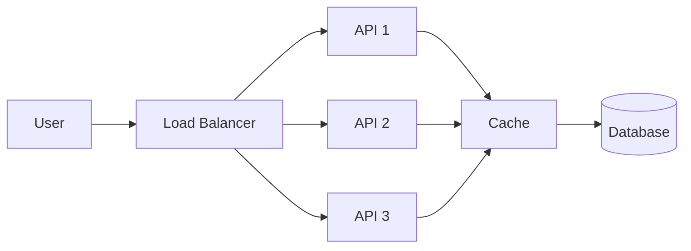
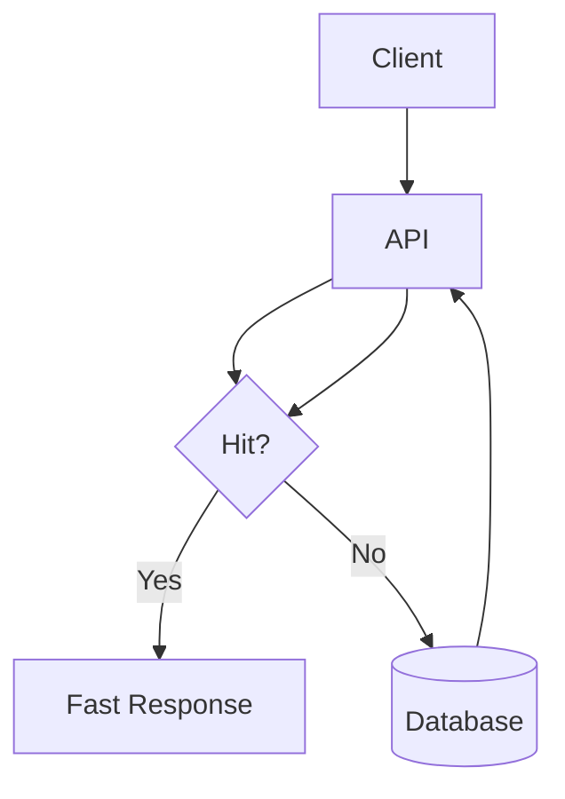
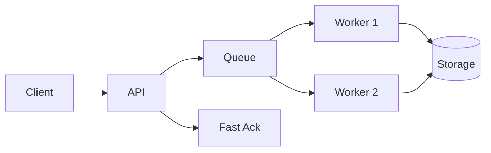
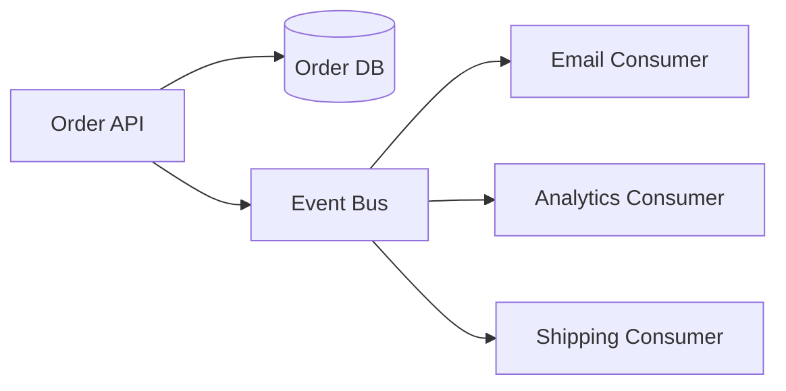
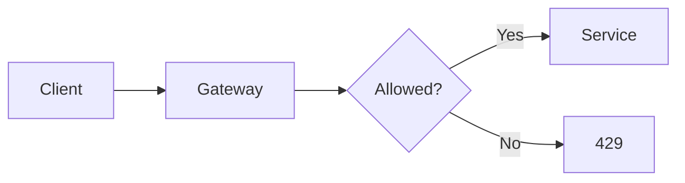
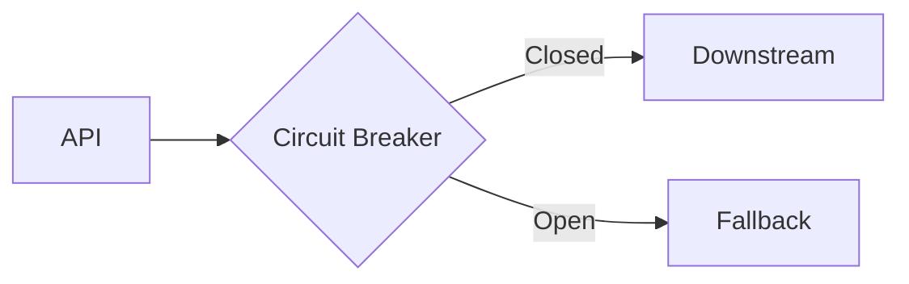
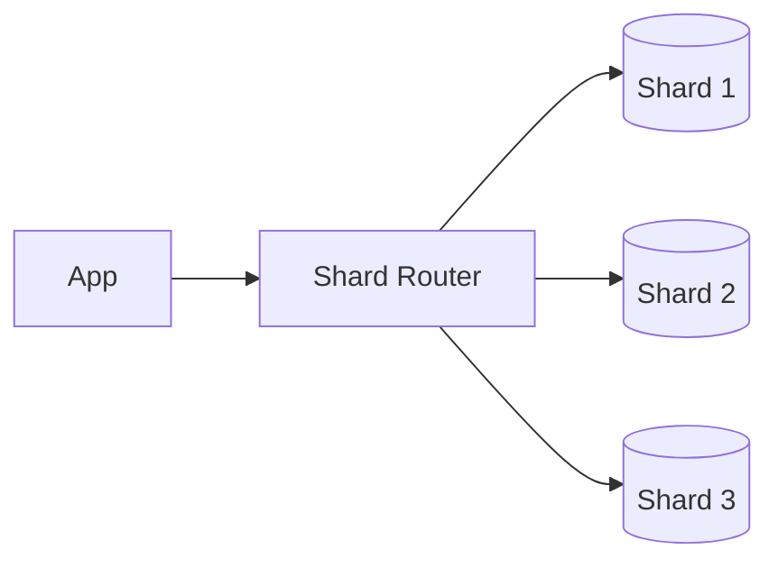

# System Design Revision Sheet

## Quick Interview Flow

1. clarify requirements
2. estimate scale
3. define high-level architecture
4. identify bottlenecks
5. explain scaling strategy
6. explain resilience strategy
7. cover observability, security, and rollout
8. summarize tradeoffs

## Core Principles

- keep compute stateless where possible
- isolate critical and non-critical paths
- scale horizontally before adding unnecessary complexity
- cache only with a clear invalidation strategy
- treat overload and failure as normal design conditions
- choose consistency level based on business need
- keep production telemetry built in from day one

## Diagrams To Remember

### Stateless Scaling

Memory point:

Scale the stateless tier horizontally and protect the database with caching.

### Cache-Aside

Memory point:

Good for read-heavy systems. Always discuss TTL and invalidation.

### Async Processing

Memory point:

Keep the request path small. Move heavy work to workers.

### Event-Driven Flow

Memory point:

Critical write first. Non-critical downstream actions should be decoupled.

### Rate Limiting

Memory point:

Protect expensive services before overload reaches them.

### Circuit Breaker

Memory point:

Stop repeated failing calls from cascading across the system.

### Sharding

Memory point:

Shard only when a single node is no longer enough. Be ready to discuss hot shards and cross-shard queries.

## Fast Tradeoff Table

- SQL: strong consistency, joins, transactions
- NoSQL: flexible schema, high scale, simpler access patterns
- Sync: immediate result, simpler user flow, higher latency pressure
- Async: better decoupling and resilience, more eventual consistency
- Cache: lower latency, less DB load, harder invalidation
- Sharding: more scale, more operational complexity
- Microservices: team and scaling flexibility, more coordination cost
- Monolith: simpler operations, weaker independent scaling at large size

## High-Value Phrases

- I want to clarify the read-write ratio before choosing a data strategy.
- I would keep the critical path small and move optional work asynchronously.
- I would design for graceful degradation instead of assuming every dependency stays healthy.
- I would validate scaling decisions with bottleneck analysis and telemetry.
- I would choose the simplest design that safely meets the reliability target.

## Bottlenecks Checklist

- CPU-bound?
- memory-bound?
- network-bound?
- IO-bound?
- database-bound?
- coordination-bound?

## Final Pre-Interview Checklist

- vertical vs horizontal scaling
- cache-aside vs write-through
- read replicas vs sharding
- sync vs async workflows
- idempotency and retries
- rate limiting and overload protection
- circuit breaker and graceful degradation
- metrics, logs, traces
- canary vs blue-green deployment
- RTO and RPO