# System Design Interview Preparation Guide

## For Solution Architect Interviews

This guide is meant for solution architect and system design interviews where you are expected to design systems that are:

- scalable
- resilient
- fault tolerant
- secure
- observable
- cost-aware
- operationally maintainable

It also covers how to design efficient APIs, how to handle growth, and how to answer system design questions in a structured way.

Use this document in two passes:

1. Study the detailed concepts and patterns until you can explain them in your own words.
2. Revisit the revision sections and interview questions before the interview.

---

## What Interviewers Actually Test

In system design interviews, interviewers are usually not checking whether you know a long list of technologies. They want to know whether you can:

- clarify requirements before designing
- choose appropriate tradeoffs
- design for scale and failure
- make APIs and data access efficient
- think about latency, throughput, and cost
- handle operational concerns such as monitoring and rollout
- explain architecture clearly under time pressure

Strong candidates do not jump into diagrams too early. They first define the problem.

---

## How To Answer A System Design Question

Use this sequence in most interviews:

1. clarify functional requirements
2. clarify non-functional requirements
3. estimate scale
4. define high-level architecture
5. drill into data flow
6. discuss bottlenecks and failure handling
7. discuss scaling and data strategy
8. discuss observability, security, and operations
9. summarize tradeoffs

### Example answer flow

If asked to design a URL shortener, do not begin with a database choice. Start by asking about expected reads and writes, custom aliases, analytics, retention, and availability targets. Then design the write path, the read path, the ID generation strategy, the cache behavior, and how you would scale the redirection service.

That structure shows discipline and architectural thinking.

---

## Core System Design Mindset

Every good system design answer balances four things:

- correctness
- performance
- resilience
- complexity

A design that scales but is too complex to operate is weak. A design that is simple but collapses under moderate traffic is also weak. Solution architects are expected to choose the simplest design that safely satisfies the requirements.

### Strong interview phrase

I prefer the simplest architecture that satisfies scale, reliability, and operational requirements, and I only add complexity when a concrete bottleneck or risk justifies it.

---

## Requirement Gathering

Before you design, clarify the problem.

### Functional requirements

Examples:

- users can create and read content
- clients can upload files
- system should send notifications
- search should support filters and ranking
- APIs should support pagination and authentication

### Non-functional requirements

Examples:

- target latency under 200 ms for read APIs
- 99.9 percent or 99.99 percent availability
- eventual consistency is acceptable for analytics
- strong consistency required for payments
- system should support 10 million daily active users
- data must be encrypted and auditable

### Why this matters

Interviewers want to see whether you can turn a vague problem into an engineering problem. A system for real-time payments is designed very differently from a social media feed, even if both use APIs, storage, and queues.

### Practical example

If asked to design a chat system, ask:

- is it one-to-one, group chat, or both
- do we need message ordering
- do we need message history forever
- how important is delivery guarantee
- are users global
- do we need typing indicators or only messaging

Those questions immediately improve design quality.

---

## Scale Estimation

You do not need perfect math. You need rough order-of-magnitude thinking.

### Estimate these early

- daily active users
- requests per second
- read-to-write ratio
- average payload size
- storage growth per day or year
- peak vs average traffic

### Example

Suppose a service has 10 million daily active users. If each user makes 20 read requests per day, that is 200 million reads per day. Divide by 86,400 seconds and you get roughly 2,300 reads per second on average. Peak could easily be 5 to 10 times higher, so now you should reason about 10,000 to 20,000 reads per second at peak.

That estimate drives whether you need caching, read replicas, sharding, or CDN support.

### Why interviewers like this

It shows that your architecture is driven by load rather than fashion.

---

## High-Level Building Blocks

Most scalable systems are built from a repeatable set of components:

- clients
- API gateway or load balancer
- stateless application services
- cache
- database
- object storage
- search index
- queue or event bus
- background workers
- monitoring and logging

### Strong principle

Keep compute stateless where possible. State is what usually makes scaling and recovery harder.

---

## Scalability Fundamentals

Scalability means the system can handle more traffic, more data, or more users without breaking or becoming too expensive.

### Vertical scaling

Vertical scaling means adding more CPU, memory, or storage to a single machine.

Good for:

- simple systems
- early-stage products
- stateful components that are hard to distribute

Limits:

- hardware ceiling
- single-node dependency
- expensive at high scale

### Horizontal scaling

Horizontal scaling means adding more instances and distributing load.

Good for:

- stateless APIs
- background workers
- read-heavy services
- globally distributed traffic

Requirements:

- load balancing
- statelessness or distributed state
- idempotent operations where possible
- good observability

### Practical example

If a product catalog API becomes slow during peak sales, the first scalable design is usually not to move to a more complex architecture. It is often to add caching, make the API servers stateless, and run more instances behind a load balancer.

### Flow example

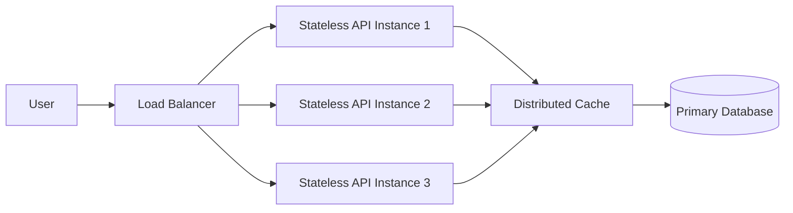
```mermaid
flowchart LR
	User[User] --> LB[Load Balancer]
	LB --> API1[Stateless API Instance 1]
	LB --> API2[Stateless API Instance 2]
	LB --> API3[Stateless API Instance 3]
	API1 --> Cache[Distributed Cache]
	API2 --> Cache
	API3 --> Cache
	Cache --> DB[(Primary Database)]
```

What this diagram shows:

- the load balancer spreads traffic across multiple stateless instances
- any API node can serve any request
- the cache absorbs repeated reads before they hit the database
- the database remains the system of record

---

## Resilience And Fault Tolerance

Resilience means the system can recover from failure. Fault tolerance means the system continues operating correctly even when some components fail.

### Common failure types

- server instance failure
- availability zone failure
- network partition
- database overload
- cache outage
- downstream dependency timeout
- message queue backlog
- deployment failure

### Techniques to improve resilience

- redundancy across instances and zones
- health checks
- timeouts
- retries with backoff
- circuit breakers
- graceful degradation
- bulkheads or isolation boundaries
- replication and backups
- rollback and feature flags

### Strong interview answer

I try to design assuming components will fail. The goal is not to prevent every failure. The goal is to isolate failure, recover quickly, and degrade gracefully when full functionality is not possible.

### Practical example

If the recommendation service fails in an ecommerce platform, checkout should still work. That is graceful degradation. Recommendations can be hidden or replaced with a fallback list instead of taking down the whole page.

### Flow example

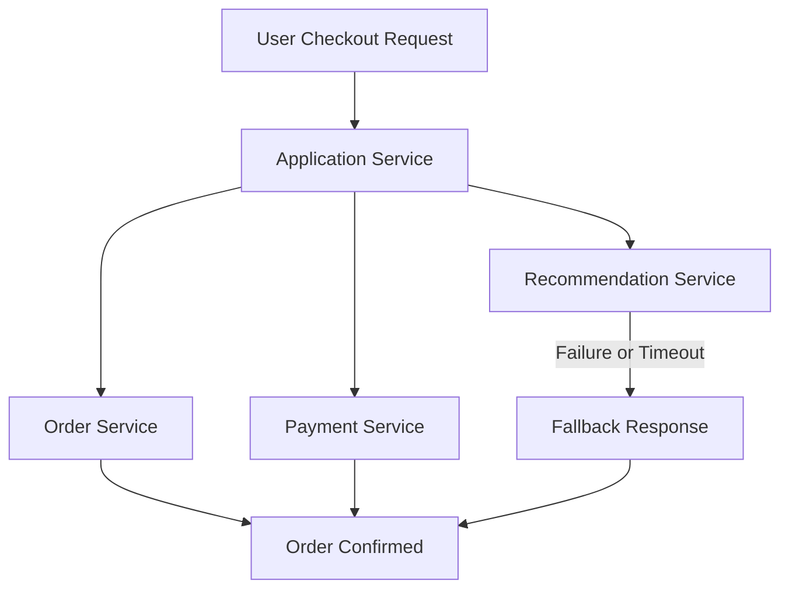
```mermaid
flowchart TD
	User[User Checkout Request] --> App[Application Service]
	App --> Order[Order Service]
	App --> Pay[Payment Service]
	App --> Reco[Recommendation Service]
	Reco -->|Failure or Timeout| Fallback[Fallback Response]
	Order --> Success[Order Confirmed]
	Pay --> Success
	Fallback --> Success
```

This is a good interview example because it shows service prioritization. Order creation and payment are critical. Recommendations are not. A resilient system protects the critical path first.

---

## Availability vs Consistency

You should be comfortable talking about CAP-style tradeoffs, even if you do not go into theory deeply.

### Practical framing

- if users are transferring money, correctness and consistency matter most
- if users are reading a social feed, eventual consistency is often acceptable
- if analytics dashboards lag by a few seconds or minutes, that is usually acceptable

### Strong interview line

I choose consistency level based on business impact. Strong consistency is critical for operations such as payments and inventory reservation, while eventual consistency is often acceptable for feeds, search indexing, and analytics.

---

## Stateless Services

Stateless services are easier to scale because any request can be handled by any healthy instance.

### Good practices

- store session state in a shared store or token
- avoid local file dependency
- externalize configuration
- keep instances disposable

### Example

If user sessions are stored in memory on one API server, you either need sticky sessions or you risk losing session continuity after scaling or failure. A better design is to use a token-based session model or shared distributed session storage.

---

## Load Balancing

Load balancers distribute incoming traffic across healthy instances.

### Why they matter

- increase availability
- support horizontal scaling
- route traffic intelligently
- remove unhealthy instances

### Interview example

If one application server becomes slow or crashes, the load balancer should stop sending traffic to it using health checks. This prevents one failing node from degrading the entire service.

---

## Caching Strategies

Caching is one of the highest-value topics in system design interviews because it is often the fastest way to improve latency and reduce load.

### What caching gives you

- lower response time
- reduced database load
- higher throughput
- better cost efficiency

### Common cache locations

- CDN cache for static content
- reverse proxy or gateway cache
- application-level cache
- database query cache
- distributed cache such as Redis

### Common caching patterns

#### Cache-aside

Application checks cache first. If data is missing, it reads from database and writes into cache.

Use when:

- read-heavy workloads
- cache misses are acceptable
- application can tolerate stale data briefly

#### Write-through

Application writes to cache and database together.

Use when:

- cache should remain warm
- read-after-write behavior matters more

#### Write-back

Application writes to cache first and database later.

Use when:

- ultra-high write throughput matters
- some risk and complexity are acceptable

### Common cache risks

- stale data
- cache invalidation mistakes
- hot keys
- cache stampede
- memory pressure

### Practical example

Suppose a product details API gets 50,000 read requests per second but product data changes only a few times per hour. A Redis cache or CDN-backed cache can drastically reduce database load. This is a classic read-heavy optimization.

### Cache-aside flow chart

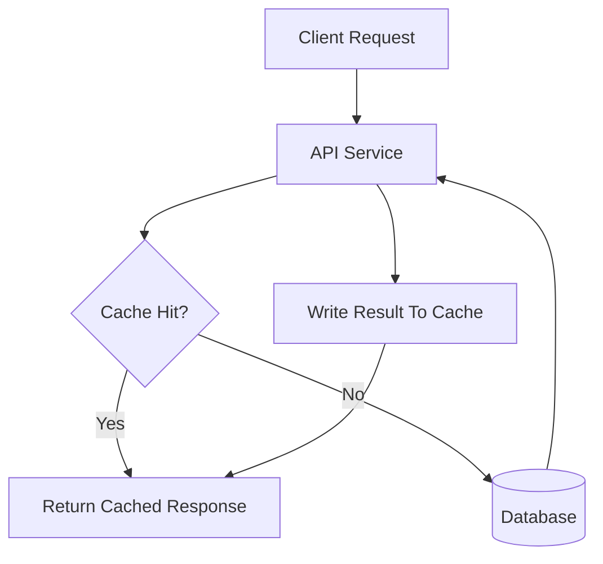
```mermaid
flowchart TD
	Client[Client Request] --> API[API Service]
	API --> Cache{Cache Hit?}
	Cache -->|Yes| Return[Return Cached Response]
	Cache -->|No| DB[(Database)]
	DB --> API
	API --> Warm[Write Result To Cache]
	Warm --> Return
```

Interview explanation:

- on a cache hit, latency is low and the database is untouched
- on a cache miss, the API fetches from the database and warms the cache
- this works well for read-heavy systems with acceptable temporary staleness

### Strong interview phrase

I add caching when the read pattern justifies it, but I always discuss invalidation strategy, TTL, and fallback behavior because caching is not free.

---

## Database Design And Data Strategy

Your database answer should depend on data shape, access pattern, consistency needs, and scale.

### SQL databases

Use when:

- data is relational
- transactions matter
- consistency is critical
- joins are common

Examples:

- payments
- orders
- inventory
- account management

### NoSQL databases

Use when:

- data model is flexible
- very high scale is needed
- access patterns are simple and predictable
- denormalization is acceptable

Examples:

- user sessions
- event logs
- catalog metadata
- activity feeds

### Read replicas

Useful when:

- read traffic is much higher than write traffic
- slightly stale reads are acceptable
- the primary database is overloaded by reads

### Partitioning and sharding

Useful when:

- a single database node cannot handle the size or throughput
- you can identify a stable partition key

### Practical example

For a social feed system, user relationship data may live in a relational store, user-generated content may live in object storage, feed metadata may live in a NoSQL store, and search may live in a separate index. Good system design often uses multiple storage systems for different purposes.

### More detailed example

For example:

- user profile and billing data may stay in SQL because transactions and consistency matter
- post content blobs or images may go to object storage because they are large and cheap to store there
- home feed entries may live in a NoSQL store because access patterns are simple and throughput can be very high
- full-text search usually works better in a search engine than in the primary transactional database

This is a strong architect answer because it shows polyglot persistence for a reason, not because multiple databases sound sophisticated.

---

## API Design For Efficiency And Scalability

This is one of the areas you asked for directly, and it is important in solution architect interviews.

Efficient APIs reduce bandwidth, reduce server work, improve latency, and make client applications simpler.

### Principles of efficient API design

- return only the data clients need
- support pagination for large result sets
- filter and sort on the server side
- use compression where appropriate
- use caching headers where possible
- avoid chatty client-server interaction
- make endpoints idempotent where appropriate
- support batch operations when justified

### Efficient read APIs

Good patterns:

- pagination instead of returning unlimited lists
- field selection to avoid over-fetching
- filtering at the source
- cursor-based pagination for large moving datasets

Bad pattern:

- returning 10,000 records because the client might need them

### Efficient write APIs

Good patterns:

- idempotency keys for retries
- validation at the API boundary
- asynchronous processing for heavy work
- bulk write APIs if the use case justifies them

### Practical example

Suppose a mobile app loads a user dashboard. A weak API design makes six separate calls for profile, orders, offers, recommendations, notifications, and account settings. A stronger design can either aggregate the response at a gateway or provide a purpose-built dashboard endpoint so the client makes fewer round trips.

### API aggregation flow chart

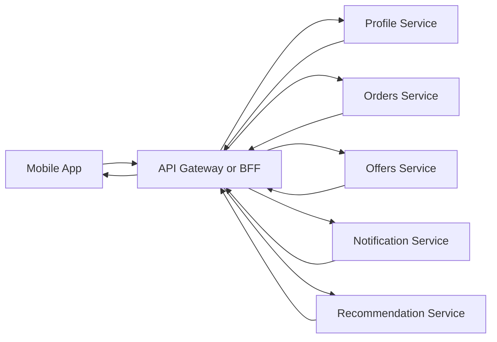
```mermaid
flowchart LR
	Mobile[Mobile App] --> Gateway[API Gateway or BFF]
	Gateway --> Profile[Profile Service]
	Gateway --> Orders[Orders Service]
	Gateway --> Offers[Offers Service]
	Gateway --> Notif[Notification Service]
	Gateway --> Reco[Recommendation Service]
	Profile --> Gateway
	Orders --> Gateway
	Offers --> Gateway
	Notif --> Gateway
	Reco --> Gateway
	Gateway --> Mobile
```

Why this is better:

- fewer client round trips
- lower mobile latency on weak networks
- one place to shape the response for the UI
- easier to evolve client-specific APIs without changing every backend service

### Another example

If a report page needs totals, trends, and top records, do not make the client call five endpoints and join data locally. Create a report-oriented API or precomputed summary endpoint. This moves complexity to the backend, where it is easier to optimize and monitor.

### Idempotency

Idempotency means the same request can be retried without causing duplicate side effects.

This is critical for:

- payments
- order creation
- retries after timeout
- distributed systems with at-least-once delivery

### Strong interview answer

To make APIs efficient, I focus on payload size, number of round trips, query efficiency, caching strategy, and idempotency. I also separate synchronous user-facing calls from heavy background processing where possible.

---

## Synchronous vs Asynchronous Processing

Not all work should happen inline on the request path.

### Use synchronous processing when

- the user needs an immediate result
- the operation is fast enough for latency targets
- consistency needs are immediate

### Use asynchronous processing when

- the task is slow or heavy
- downstream systems are unreliable
- the work can be retried later
- the user can tolerate delayed completion

### Examples of asynchronous work

- sending emails
- image processing
- search indexing
- analytics event processing
- invoice generation

### Practical example

When a user uploads an image, the API can store metadata and return quickly, while background workers handle thumbnail generation, virus scanning, and multiple-format conversion. That keeps the user-facing API fast and resilient.

### Async processing flow chart

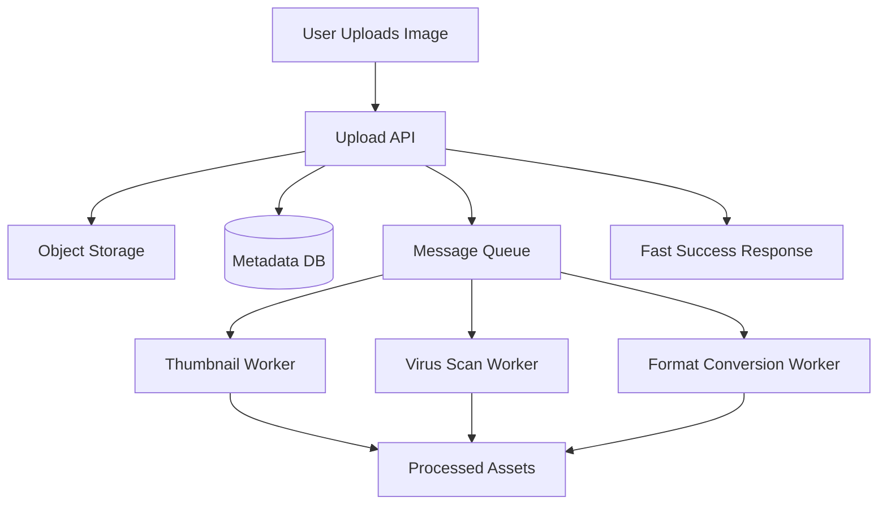
```mermaid
flowchart TD
	User[User Uploads Image] --> API[Upload API]
	API --> Store[Object Storage]
	API --> Meta[(Metadata DB)]
	API --> Queue[Message Queue]
	API --> Ack[Fast Success Response]
	Queue --> Thumb[Thumbnail Worker]
	Queue --> Scan[Virus Scan Worker]
	Queue --> Format[Format Conversion Worker]
	Thumb --> Done[Processed Assets]
	Scan --> Done
	Format --> Done
```

This is a strong pattern because the user-facing request finishes quickly while heavy or failure-prone work is isolated in background workers.

---

## Queues And Event-Driven Design

Queues decouple producers from consumers and help systems absorb spikes.

### Benefits

- smoothing traffic spikes
- retry support
- decoupled services
- better failure isolation
- asynchronous scalability

### Risks and design concerns

- duplicate messages
- poison messages
- out-of-order delivery
- backlog growth
- consumer lag

### Good interview points

- consumers should be idempotent
- dead-letter queues should exist for repeated failures
- queue depth should be monitored
- retry policy should be controlled, not infinite

### Practical example

If an order is placed, the system does not need to synchronously send email, update analytics, notify shipping, and recompute recommendations in the same API request. The order API can write the critical transaction, publish an event, and let downstream consumers process their work independently.

### Event-driven flow chart

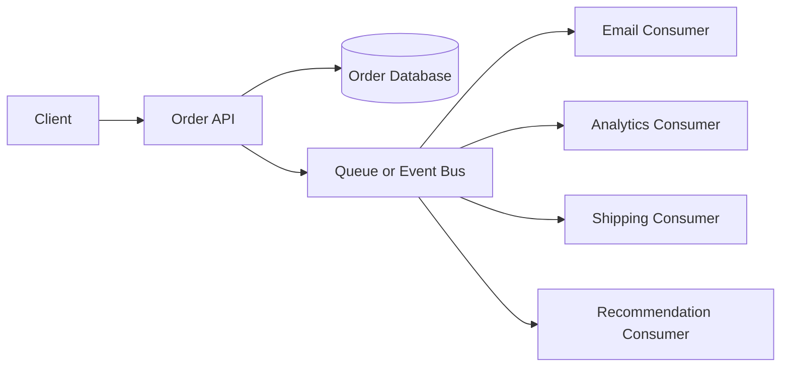
```mermaid
flowchart LR
	Client[Client] --> OrderAPI[Order API]
	OrderAPI --> OrderDB[(Order Database)]
	OrderAPI --> EventBus[Queue or Event Bus]
	EventBus --> Email[Email Consumer]
	EventBus --> Analytics[Analytics Consumer]
	EventBus --> Shipping[Shipping Consumer]
	EventBus --> Reco[Recommendation Consumer]
```

Interview explanation:

- the critical path ends after the order is safely recorded
- non-critical follow-up work is decoupled
- a temporary email failure should not block order placement
- each consumer can scale independently

---

## Rate Limiting, Backpressure, And Overload Protection

Systems fail not only because of bugs, but because they get overloaded.

### Common protections

- rate limiting per client or token
- quotas
- request size limits
- bounded queues
- timeouts
- circuit breakers
- admission control

### Why this matters

Without overload protection, one aggressive client or one traffic spike can degrade the whole platform.

### Practical example

If an expensive search API can only safely handle 5,000 queries per second, the system should limit or degrade excess traffic rather than letting latency grow until the whole service collapses.

### Rate-limiting flow chart

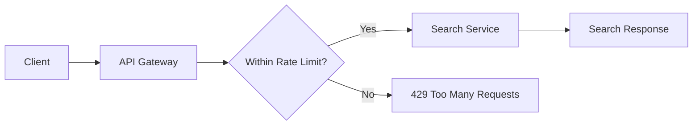
```mermaid
flowchart LR
	Client[Client] --> Gateway[API Gateway]
	Gateway --> Limit{Within Rate Limit?}
	Limit -->|Yes| Service[Search Service]
	Limit -->|No| Reject[429 Too Many Requests]
	Service --> Response[Search Response]
```

This diagram is useful in interviews because it shows that overload is handled before expensive work begins.

### Backpressure flow chart

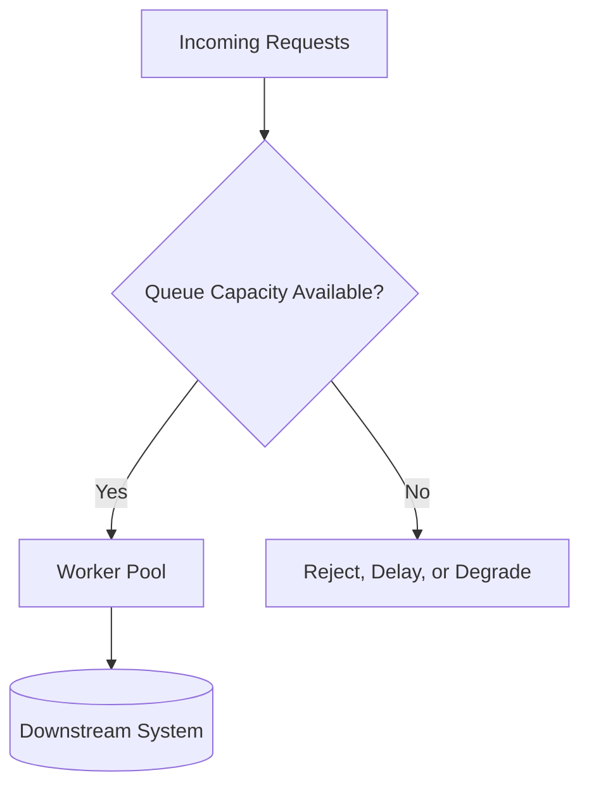
```mermaid
flowchart TD
	Producer[Incoming Requests] --> Queue{Queue Capacity Available?}
	Queue -->|Yes| Worker[Worker Pool]
	Queue -->|No| Shed[Reject, Delay, or Degrade]
	Worker --> DB[(Downstream System)]
```

This is a good example when discussing bounded queues. A queue is not a magic buffer with infinite capacity. Once it grows beyond safe limits, the system must slow intake, reject low-priority work, or degrade gracefully.

### Circuit breaker flow chart

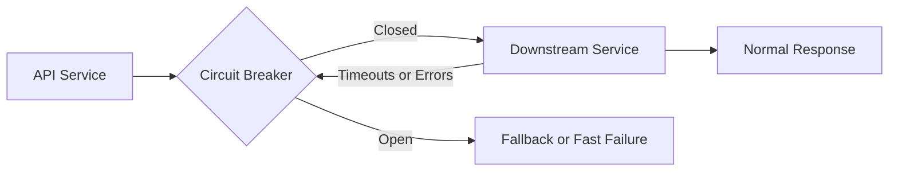
```mermaid
flowchart LR
	API[API Service] --> CB{Circuit Breaker}
	CB -->|Closed| Downstream[Downstream Service]
	Downstream --> Result[Normal Response]
	Downstream -->|Timeouts or Errors| CB
	CB -->|Open| Fallback[Fallback or Fast Failure]
```

This is useful when a dependency is failing repeatedly. Instead of continuing to send traffic and wasting resources, the circuit breaker opens temporarily and protects the rest of the system.

### Strong interview line

I do not assume infinite elasticity. I design for controlled behavior under overload so the system fails gracefully instead of catastrophically.

---

## Observability

If a system cannot be understood in production, it is not ready for production.

### Three pillars

- logs
- metrics
- traces

### What to monitor

- latency
- throughput
- error rate
- saturation
- queue depth
- cache hit ratio
- database connection usage
- replication lag

### Practical example

If latency rises, tracing can help reveal whether the root cause is a slow database query, a downstream service timeout, or lock contention. Without tracing, teams often guess wrong and waste time.

### Strong interview phrase

Observability is part of architecture. I want enough telemetry to detect failure early, localize it quickly, and know whether the system is recovering.

---

## Deployment Safety And Release Strategy

A strong design answer should mention how changes are rolled out.

### Common strategies

- rolling deployment
- blue-green deployment
- canary deployment
- feature flags

### Why this matters

Many incidents happen during deployment rather than during steady state. A good architect designs for safe change, not just normal traffic.

### Practical example

If a new recommendation engine version is risky, deploy it to a small percentage of traffic first. Watch latency, error rate, and business metrics. Then gradually increase exposure if healthy. That is a stronger answer than saying we deploy the new version and monitor it.

---

## Geographic Scale And Disaster Recovery

When systems grow, region-level design becomes important.

### Multi-region questions to think about

- do users need low latency globally
- what is the acceptable recovery time objective
- what is the acceptable recovery point objective
- does data need strong global consistency
- can regions operate independently

### Disaster recovery patterns

- backup and restore
- pilot light
- warm standby
- active-active

### Strong interview answer

I choose the disaster recovery pattern based on RTO and RPO rather than overdesigning for active-active by default. The architecture should match business criticality.

---

## Security In System Design

Even when the interview is called system design, security is part of architecture.

### Security layers to mention

- authentication and authorization
- encryption in transit and at rest
- secrets management
- least privilege access
- network boundaries
- audit logging
- input validation
- abuse protection

### Practical example

If you design a file-upload service, do not stop at storage and scaling. Mention signed upload URLs, malware scanning, access control, object lifecycle, and audit logging.

---

## Common Bottlenecks And How To Think About Them

### Application bottlenecks

- inefficient algorithms
- blocking calls on the request path
- thread pool exhaustion
- excessive serialization or payload size

### Database bottlenecks

- missing indexes
- full table scans
- hot rows
- lock contention
- too many joins under high load

### Cache bottlenecks

- low hit ratio
- hot keys
- single shard pressure
- cache stampede

### Network bottlenecks

- too many round trips
- large responses
- chatty microservices
- cross-region latency

### Strong interview approach

When I see a bottleneck, I first identify whether it is CPU-bound, IO-bound, memory-bound, data-bound, or coordination-bound. That helps avoid random optimizations.

### Sharding flow chart

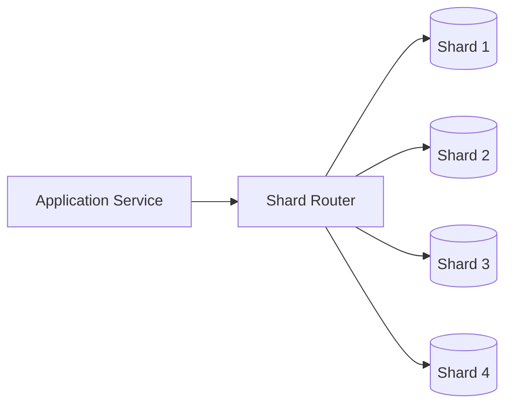
```mermaid
flowchart LR
	App[Application Service] --> Router[Shard Router]
	Router --> S1[(Shard 1)]
	Router --> S2[(Shard 2)]
	Router --> S3[(Shard 3)]
	Router --> S4[(Shard 4)]
```

Interview explanation:

- the router chooses the shard based on a partition key such as `user_id`
- each shard holds only part of the dataset and part of the traffic
- this increases scale but also adds complexity around rebalancing, cross-shard queries, and hot partitions

---

## How To Make APIs More Efficient

This is a direct revision section focused on what interviewers often ask.

### Reduce payload size

- return only necessary fields
- compress responses where appropriate
- avoid repeated metadata

### Reduce round trips

- aggregate related data
- use batching when justified
- avoid unnecessary chatty APIs

### Reduce backend work

- add caching
- precompute expensive views when possible
- paginate large lists
- move heavy tasks to async workers

### Improve reliability under retries

- make writes idempotent
- use request IDs and deduplication where needed

### Improve database interaction

- index the right fields
- avoid N+1 query patterns
- use read replicas for read-heavy loads
- tune query plans and access patterns

### Practical example

Suppose a reporting endpoint joins multiple large tables, calculates totals, and returns a huge dataset every time a dashboard loads. A better design might use pre-aggregated reporting tables, scheduled background jobs, pagination, and cached summaries. That shifts expensive work off the request path.

---

## How To Make A System More Scalable

This is the other direct interview theme you asked for.

### A practical checklist

- make services stateless where possible
- scale horizontally behind a load balancer
- add caching for read-heavy paths
- decouple heavy workflows using queues
- use appropriate database partitioning
- add read replicas for read-heavy databases
- move large blobs to object storage
- use CDN for static content
- reduce synchronous dependencies
- add observability before scaling blindly

### Strong interview line

Scalability is not one feature. It is usually the result of stateless compute, efficient data access, decoupled workflows, and measured bottleneck removal.

---

## Sample System Design Scenarios

## 1. Design A URL Shortener

### Requirements

- create short URLs
- redirect quickly
- high read volume
- low write volume compared with reads
- custom aliases may exist

### High-level design

- API service for create and redirect
- ID generation service or deterministic encoding
- database for mappings
- cache for hot URL lookups
- analytics pipeline for click events

### Request flow chart

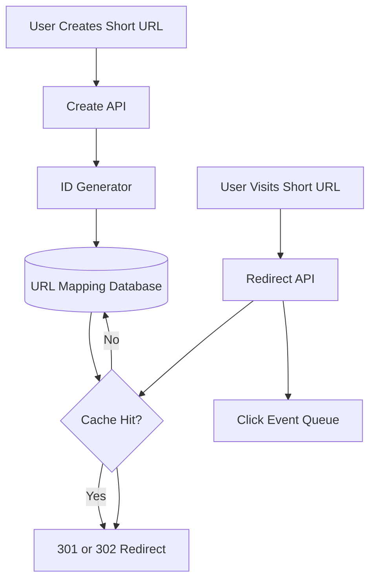
```mermaid
flowchart TD
	User[User Creates Short URL] --> CreateAPI[Create API]
	CreateAPI --> IDGen[ID Generator]
	IDGen --> MapDB[(URL Mapping Database)]
	User2[User Visits Short URL] --> RedirectAPI[Redirect API]
	RedirectAPI --> Cache{Cache Hit?}
	Cache -->|Yes| Redirect[301 or 302 Redirect]
	Cache -->|No| MapDB
	MapDB --> Cache
	Cache --> Redirect
	RedirectAPI --> Events[Click Event Queue]
```

### Deeper explanation

The redirect path is read-heavy and latency-sensitive, so caching matters more there than on the create path. Analytics should usually be asynchronous so that click tracking does not slow down redirection.

### Key interview points

- redirects are read-heavy, so caching is valuable
- IDs must be unique and collision-safe
- analytics can be asynchronous
- abuse prevention matters

## 2. Design A Notification System

### Requirements

- send email, SMS, and push notifications
- support retries and templates
- handle spikes

### High-level design

- notification API
- queue for decoupling
- worker pools by channel
- provider adapters
- retry and dead-letter handling
- preference and template store

### Flow chart

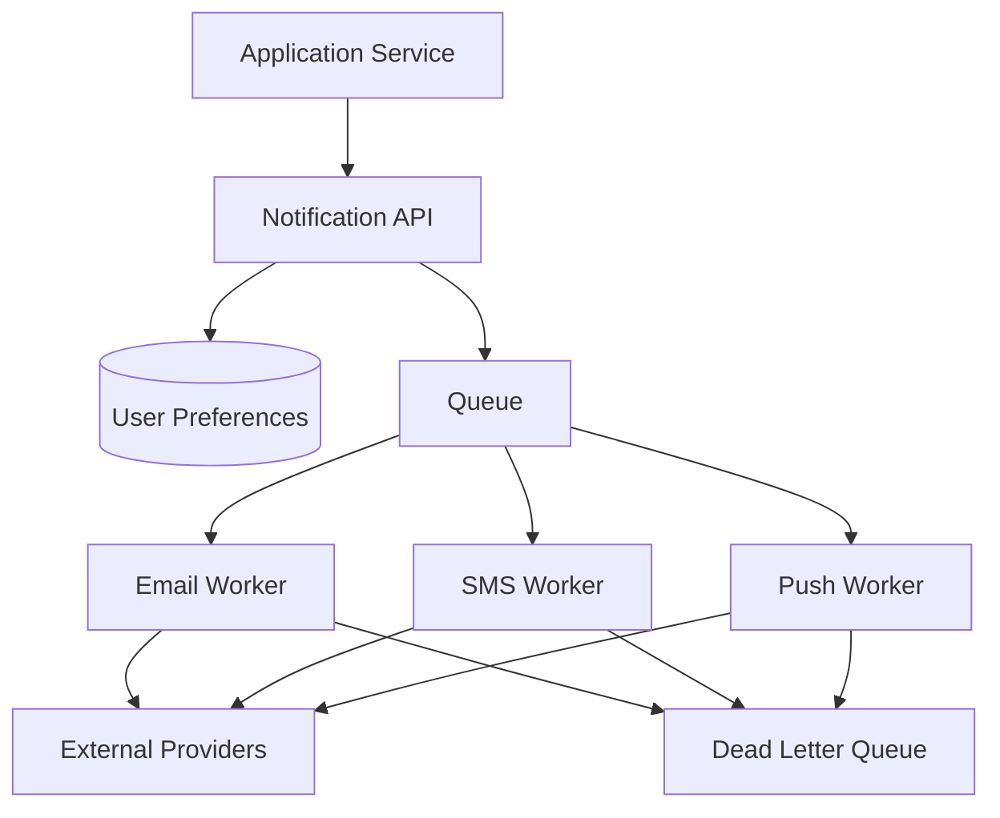
```mermaid
flowchart TD
	App[Application Service] --> NotifAPI[Notification API]
	NotifAPI --> Pref[(User Preferences)]
	NotifAPI --> Queue[Queue]
	Queue --> EmailW[Email Worker]
	Queue --> SMSW[SMS Worker]
	Queue --> PushW[Push Worker]
	EmailW --> Providers[External Providers]
	SMSW --> Providers
	PushW --> Providers
	EmailW --> DLQ[Dead Letter Queue]
	SMSW --> DLQ
	PushW --> DLQ
```

### Deeper explanation

This system should be designed around asynchronous delivery, retries, and user preferences. A strong answer also mentions deduplication, rate limiting, and template rendering so the notification layer remains reusable.

### Key interview points

- delivery is asynchronous
- failures should not block core product workflows
- user preference and deduplication matter

## 3. Design An Ecommerce Platform

### Requirements

- browse catalog
- manage cart
- place orders
- handle payments
- support inventory consistency

### High-level design

- catalog service with heavy caching
- cart service with low-latency storage
- order service with transactional guarantees
- payment integration with idempotency
- event bus for downstream processing

### Flow chart

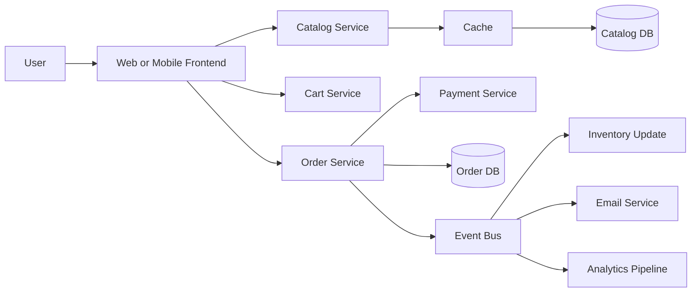
```mermaid
flowchart LR
	User[User] --> Frontend[Web or Mobile Frontend]
	Frontend --> Catalog[Catalog Service]
	Frontend --> Cart[Cart Service]
	Frontend --> Order[Order Service]
	Catalog --> Cache[Cache]
	Cache --> CatalogDB[(Catalog DB)]
	Order --> Payment[Payment Service]
	Order --> OrderDB[(Order DB)]
	Order --> Events[Event Bus]
	Events --> Inventory[Inventory Update]
	Events --> Email[Email Service]
	Events --> Analytics[Analytics Pipeline]
```

### Deeper explanation

Browsing traffic is typically much larger than checkout traffic, so the catalog path should be aggressively optimized for reads using caching and CDN patterns. Orders and payments are different: they are lower volume but demand stronger correctness, idempotency, and auditability.

### Key interview points

- product browsing is read-heavy and cache-friendly
- orders and payments require stronger consistency
- recommendation failures should not block checkout

## 4. Design A Chat System

### Requirements

- low-latency messaging
- one-to-one and group chat
- online status
- message persistence

### High-level design

- gateway for persistent connections
- messaging service
- message store
- fan-out strategy
- push notification integration

### Flow chart

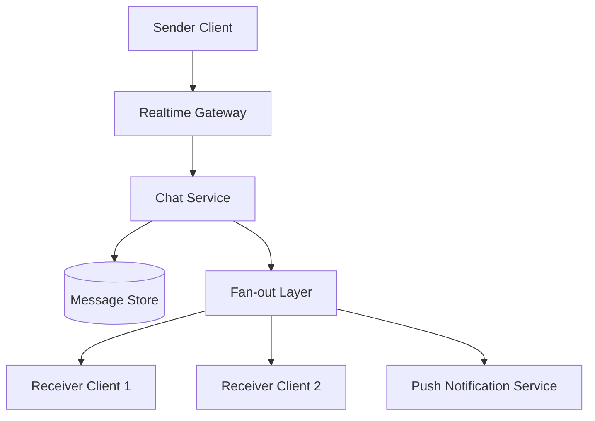
```mermaid
flowchart TD
	Sender[Sender Client] --> Gateway[Realtime Gateway]
	Gateway --> ChatSvc[Chat Service]
	ChatSvc --> MsgStore[(Message Store)]
	ChatSvc --> Fanout[Fan-out Layer]
	Fanout --> Receiver1[Receiver Client 1]
	Fanout --> Receiver2[Receiver Client 2]
	Fanout --> Push[Push Notification Service]
```

### Deeper explanation

Chat systems force you to think carefully about online presence, message ordering, delivery guarantees, and fan-out cost. Small groups are relatively easy. Very large groups require special treatment because fan-out can become the dominant cost and bottleneck.

### Key interview points

- delivery guarantees and ordering matter
- fan-out for large groups can be expensive
- online presence is different from durable history

## 5. Design A Payment System

### Requirements

- process payments safely
- avoid duplicate charge
- support retries and reconciliation
- maintain audit trail

### High-level design

- payment API
- idempotency layer
- payment orchestration service
- ledger or transaction store
- provider integration layer
- reconciliation and settlement workers

### Flow chart

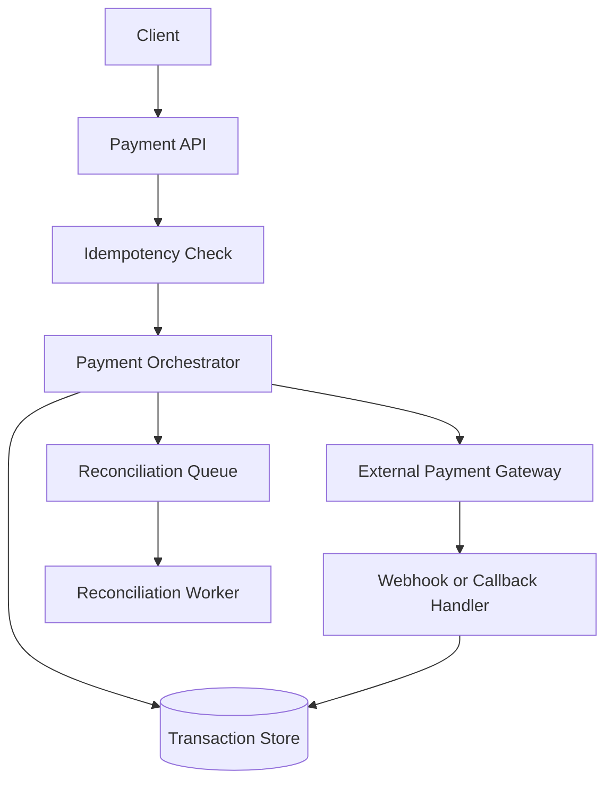
```mermaid
flowchart TD
	Client[Client] --> PayAPI[Payment API]
	PayAPI --> Idem[Idempotency Check]
	Idem --> Orchestrator[Payment Orchestrator]
	Orchestrator --> Ledger[(Transaction Store)]
	Orchestrator --> Gateway[External Payment Gateway]
	Gateway --> Callback[Webhook or Callback Handler]
	Callback --> Ledger
	Orchestrator --> Queue[Reconciliation Queue]
	Queue --> Recon[Reconciliation Worker]
```

### Deeper explanation

This is a strong scenario because it forces you to talk about correctness before scale. Payment systems are not primarily about extreme traffic. They are about idempotency, consistency, auditability, retries, timeouts, and reconciliation when external gateways behave unpredictably.

### Key interview points

- idempotency is mandatory
- external provider callbacks must be verified and reconciled
- the ledger or transaction record must be durable and auditable
- retries should never create duplicate charges

## 6. Design A Social Feed System

### Requirements

- users create posts
- followers see updates
- feed loads quickly
- support high read volume

### High-level design

- post creation service
- follow graph store
- fan-out or hybrid feed generation
- feed cache
- media storage
- ranking pipeline

### Flow chart

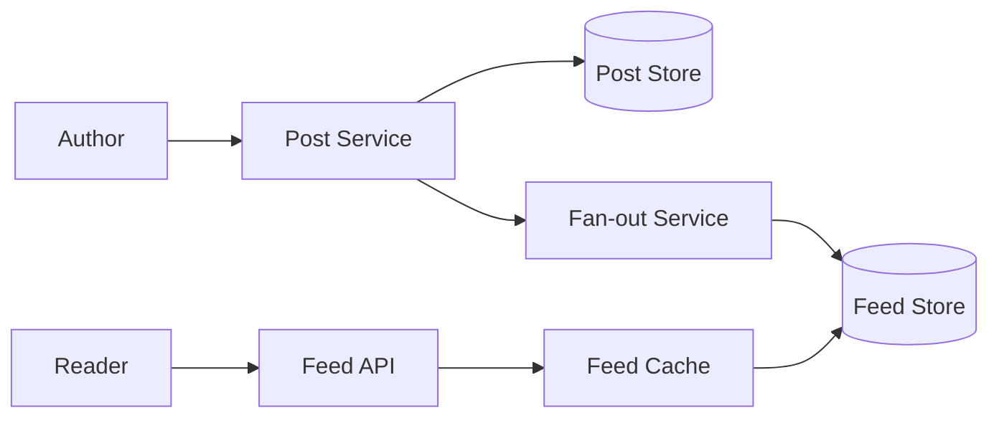
```mermaid
flowchart LR
	Author[Author] --> PostAPI[Post Service]
	PostAPI --> PostStore[(Post Store)]
	PostAPI --> Fanout[Fan-out Service]
	Fanout --> FeedStore[(Feed Store)]
	Reader[Reader] --> FeedAPI[Feed API]
	FeedAPI --> Cache[Feed Cache]
	Cache --> FeedStore
```

### Deeper explanation

Social feed design is useful because it tests read-heavy optimization and tradeoffs between fan-out on write and fan-out on read. For normal users, precomputing feed entries can keep reads fast. For celebrity accounts with millions of followers, pure fan-out on write may become too expensive, so hybrid strategies are often discussed.

### Key interview points

- read traffic dominates in most feed systems
- ranking and freshness can conflict with pure cache simplicity
- large-follower accounts create fan-out pressure

## 7. Design A Search System

### Requirements

- full-text search
- relevance ranking
- filters and pagination
- low-latency queries

### High-level design

- indexing pipeline
- search API
- search index cluster
- query cache
- analytics for relevance tuning

### Flow chart

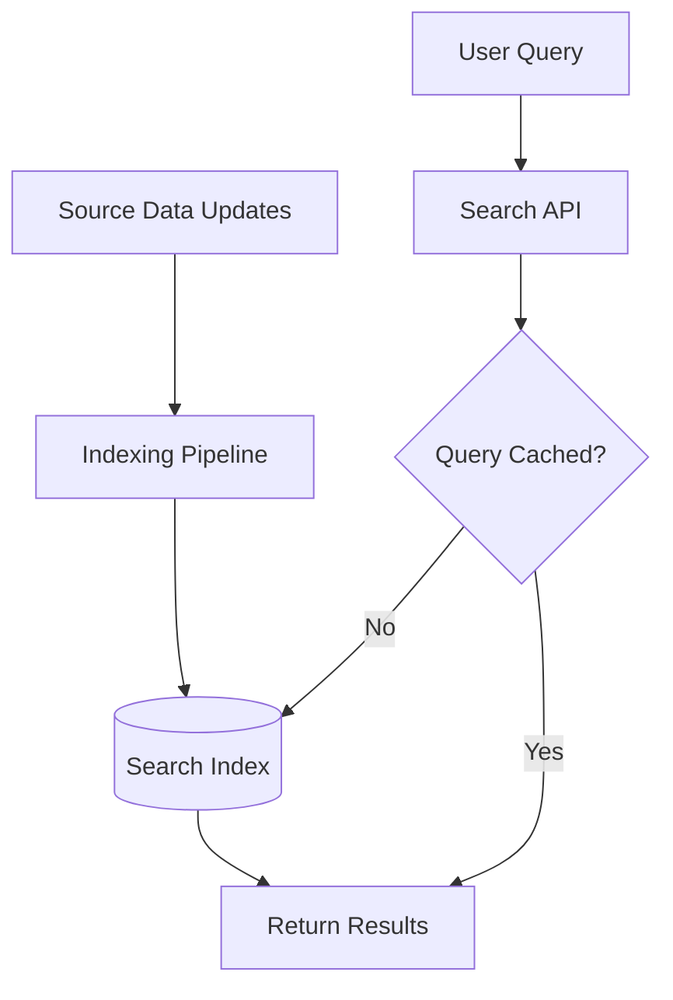
```mermaid
flowchart TD
	Source[Source Data Updates] --> Indexer[Indexing Pipeline]
	Indexer --> SearchIndex[(Search Index)]
	User[User Query] --> SearchAPI[Search API]
	SearchAPI --> Cache{Query Cached?}
	Cache -->|Yes| Results[Return Results]
	Cache -->|No| SearchIndex
	SearchIndex --> Results
```

### Deeper explanation

Search is a strong interview topic because it highlights eventual consistency. New content is usually written to the primary store first and indexed asynchronously. That means search results may lag slightly behind writes, and that tradeoff is often acceptable.

### Key interview points

- indexing is often asynchronous
- search engines are optimized for query and ranking, not transactional correctness
- filters, pagination, and ranking logic drive query performance

## 8. Design A File Upload And Processing System

### Requirements

- upload large files safely
- support scanning and transformation
- handle spikes
- enforce access control

### High-level design

- upload API for metadata and signed URL generation
- object storage for raw files
- async processing workers
- metadata store
- notification or callback mechanism

### Flow chart

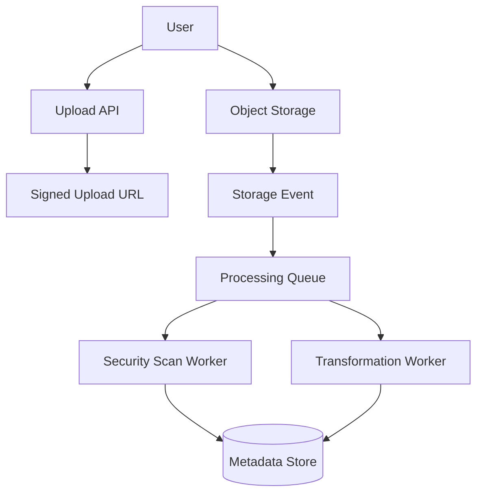
```mermaid
flowchart TD
	User[User] --> API[Upload API]
	API --> Signed[Signed Upload URL]
	User --> Storage[Object Storage]
	Storage --> Event[Storage Event]
	Event --> Queue[Processing Queue]
	Queue --> Scan[Security Scan Worker]
	Queue --> Convert[Transformation Worker]
	Scan --> Meta[(Metadata Store)]
	Convert --> Meta
```

### Deeper explanation

This is a strong scenario because it combines API efficiency, asynchronous processing, storage design, and security. Signed URLs remove the need to proxy large uploads through the application tier, which reduces server load and improves scalability.

### Key interview points

- large file transfer should usually bypass the main application servers
- scanning and processing should be asynchronous
- access control and auditability are part of the architecture

---

## 25 High-Probability System Design Interview Questions With Model Answers

## 1. How do you design for scale when requirements are uncertain?

I start with a design that is simple, observable, and modular enough to evolve. I clarify the likely growth areas, such as read load, write load, or storage growth, and I avoid overengineering before those bottlenecks are real. Then I make early choices that preserve scaling options later, such as stateless services, load balancing, externalized state, and clean service boundaries.

## 2. How do you estimate system capacity quickly?

I use rough order-of-magnitude estimates. I calculate expected daily active users, requests per user, request size, read-write ratio, and peak multiplier. That gives me approximate throughput, storage growth, and hot paths. The goal is not exact math. The goal is to make architecture choices based on realistic scale rather than guesswork.

## 3. When do you use SQL vs NoSQL?

I use SQL when the data is relational, transactions matter, consistency is important, and queries need joins or strong schema discipline. I use NoSQL when access patterns are simple and predictable, data volume is very large, or a flexible schema and horizontal scaling are more important than relational consistency. The choice should follow access patterns and business correctness needs.

## 4. How do you decide whether to cache?

I cache when the read volume is high, the underlying data changes less often than it is read, and the latency or database load justifies the extra complexity. I always discuss cache invalidation, TTL, hit ratio, and fallback behavior, because caching can create correctness and consistency issues if handled carelessly.

## 5. How do you avoid cache stampede?

I use techniques such as request coalescing, staggered TTLs, background refresh, and short-term locking around regeneration of hot keys. If a very hot item expires for many users at once, I want only one or a few requests to rebuild it rather than every request hitting the database simultaneously.

## 6. How do you make APIs idempotent?

For operations such as payments or order creation, I use an idempotency key or unique request identifier so that retries do not create duplicate side effects. The server stores the result of the first successful request and reuses it for repeated requests with the same key. This is critical in distributed systems where retries are common.

## 7. How do you design for graceful degradation?

I identify the critical path and the optional features. Then I ensure optional components can fail without taking down the core workflow. For example, checkout should still succeed even if recommendations, analytics, or non-critical notifications are delayed or unavailable.

## 8. When do you use asynchronous processing?

I use asynchronous processing when the task is slow, resource-heavy, failure-prone, or not required to complete before the user gets a response. Good examples include email sending, media processing, analytics pipelines, indexing, and downstream notifications.

## 9. How do you protect systems from overload?

I use rate limiting, admission control, timeouts, bounded queues, bulkheads, and circuit breakers. I also prioritize requests where needed and reject or degrade non-critical traffic earlier, instead of letting the entire system slow down until it becomes unavailable.

## 10. How do you reduce database bottlenecks?

I start with the basics: indexing, query tuning, avoiding full scans, reducing lock contention, and fixing hot rows. Then I consider caching, read replicas, data denormalization, precomputation, partitioning, or sharding if scale requires it. I do not jump to sharding before simpler issues are ruled out.

## 11. How do you improve API latency?

I reduce round trips, reduce payload size, cache read-heavy data, move heavy processing off the request path, optimize database access, and remove unnecessary synchronous dependencies. I also use tracing to confirm where latency is actually coming from before optimizing blindly.

## 12. How do you handle retries safely?

Retries should be bounded, use exponential backoff with jitter, and avoid retry storms. The operations themselves should be idempotent or protected against duplication. I also separate transient failures from permanent failures so the retry policy is selective rather than automatic for everything.

## 13. How do you scale read-heavy systems?

Read-heavy systems usually benefit first from CDN caching, application caching, distributed caches, and read replicas. If the dataset is global or very large, I also look at denormalized read models, precomputed views, and regional replication based on user geography.

## 14. How do you scale write-heavy systems?

For write-heavy systems, I focus on efficient write paths, batching where appropriate, asynchronous processing, partitioning by a stable key, and reducing unnecessary coordination. I also think carefully about consistency and whether all writes truly need immediate synchronous processing.

## 15. When do you shard a database?

I shard when a single node can no longer handle the throughput, storage, or contention, and when I have a stable partition key such as user ID or tenant ID. Sharding solves scale problems, but it introduces complexity around rebalancing, hot shards, cross-shard queries, and operational management.

## 16. How do you design for multi-region availability?

I first ask whether multi-region is truly required for business continuity or latency. Then I evaluate data consistency needs, user geography, and recovery objectives. Some systems only need regional failover. Others need active-active traffic. The decision should reflect business impact, not just architectural ambition.

## 17. How do you choose a disaster recovery strategy?

I start with RTO and RPO. If the system can tolerate slow recovery, backup and restore may be enough. If recovery must be faster, I consider pilot light or warm standby. If the business requires continuous availability across regional failure, then active-active may be justified.

## 18. How do you design observability into a system?

I include structured logging, key service and infrastructure metrics, distributed tracing, alerting, and dashboards from the beginning. I want telemetry that helps me detect failures early, identify the bottleneck, and confirm whether remediation is working.

## 19. How do you separate critical and non-critical paths?

I map the user journey and identify which operations must complete immediately for correctness and user value. Those stay on the synchronous path. Analytics, emails, recommendations, and many enrichment tasks can usually move to asynchronous paths so failures there do not block the primary workflow.

## 20. How do you decide whether to use microservices?

I do not default to microservices. I choose them when there is a clear need for independent scaling, team ownership boundaries, deployment independence, or technology separation. If those needs are weak, a modular monolith is often simpler and safer.

## 21. How do you handle eventual consistency?

I make eventual consistency explicit in the design and use it only where the business impact is acceptable. I communicate which views may lag, design compensation or reconciliation where needed, and ensure user-facing workflows are not misleading when data updates are asynchronous.

## 22. How do you design efficient client-server interactions?

I reduce round trips, aggregate related data, paginate large datasets, return only necessary fields, and use caching when appropriate. I also consider client-specific APIs or a backend-for-frontend pattern when mobile or web applications need tailored responses.

## 23. How do you reduce blast radius in distributed systems?

I isolate services, data, queues, and failure domains. I use bulkheads, rate limits, separate worker pools, scoped retries, and clear dependency boundaries so one failing component does not consume all shared resources.

## 24. How do you deploy safely at scale?

I use staged rollout strategies such as canary or blue-green deployment, health-based rollback, feature flags, and strong observability. The goal is to limit exposure first, detect issues quickly, and reverse safely before the whole user base is affected.

## 25. How do you reason about tradeoffs in system design?

I compare options across correctness, latency, scale, resilience, operational complexity, and cost. I try to preserve the most business-critical properties first and accept complexity only when there is a concrete need. A good system design answer should show not just what I chose, but why I did not choose the alternatives.

---

## Strong Phrases To Use In Interviews

- I want to clarify the read-write ratio before choosing the data path.
- I would keep the request path small and move heavy work asynchronously.
- I would scale the stateless layer horizontally and isolate state carefully.
- I would add caching only with a clear invalidation strategy.
- I would design for graceful degradation instead of assuming every dependency is always healthy.
- I would decide consistency level based on business impact, not technical preference.
- I would use observability to validate whether the design is behaving as expected under load.

---

## Common Weak Answers To Avoid

- jumping straight to tools without clarifying requirements
- choosing microservices by default
- saying use cache without discussing invalidation
- saying use queue without discussing retries and duplicate handling
- ignoring observability and deployment safety
- not separating critical path and non-critical path
- not discussing data consistency where it matters
- proposing global scale when the problem does not need it

---

## Last-Minute Revision Checklist

Before the interview, make sure you can explain clearly:

- vertical vs horizontal scaling
- stateless vs stateful services
- cache-aside vs write-through caching
- SQL vs NoSQL tradeoffs
- read replicas vs sharding
- synchronous vs asynchronous workflows
- idempotency and retry safety
- graceful degradation and circuit breakers
- rate limiting and overload protection
- metrics, logs, and traces
- blue-green vs canary rollout
- RTO and RPO in disaster recovery

---

## Short Self-Introduction Template

I approach system design from a solution architecture perspective, with a focus on scalability, resilience, fault tolerance, API efficiency, and operational safety. My usual design process is to clarify the requirements, estimate scale, choose the simplest architecture that meets the need, and then validate the design against failure modes, observability, and future growth. I pay close attention to efficient data access, asynchronous processing, graceful degradation, and safe rollout because those are often what separate a design that works in theory from one that works in production.